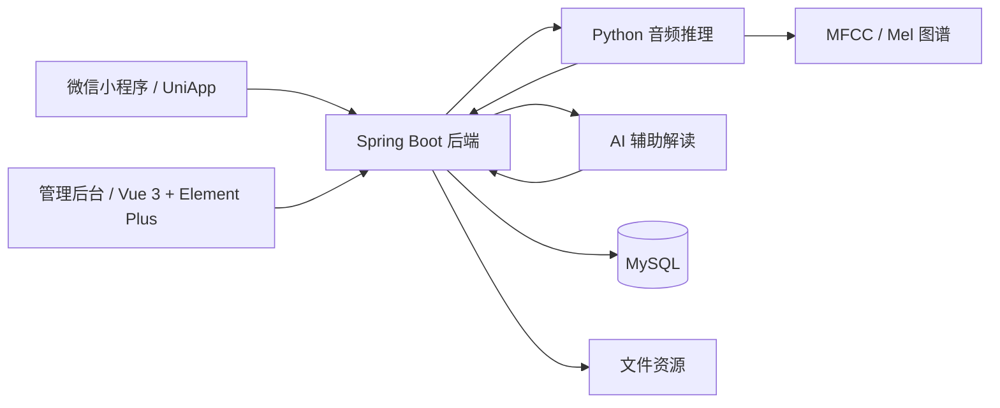

# 居家喉部健康音频自查小程序

> 一个面向居家场景的喉部健康自查与长期管理平台。项目以本地音频识别模型作为核心检测能力，结合微信小程序、管理后台、Spring Boot 后端与 AI 辅助解读，形成从自查、记录、提醒到随访的完整闭环。

## 项目简介

`HealthControl` 是一个围绕“居家喉部健康管理”设计的全链路项目，包含：

- 用户侧微信小程序 / UniApp 前端
- 管理侧 Vue 3 + Element Plus 后台
- Spring Boot 后端服务
- Python 音频推理与图谱生成能力
- AI 辅助解读与健康建议模块

这个项目的重点不是“只做一次检测”，而是把检测结果继续沉淀为可追踪的健康数据，支持症状记录、健康档案、问卷评估、饮食建议、提醒通知、隐私设置和数据权利申请等能力。

> 说明
>
> - 本地音频模型负责核心初筛。
> - AI 负责辅助解读、建议生成与问答支持。
> - 项目结果仅用于健康参考，不替代医生诊断。

## 项目亮点

- 本地模型为核心：音频初筛由本地 Python 模型完成，不依赖外部 AI 才能得到基础结果。
- 端到端闭环：从录音上传、检测、报告、档案沉淀，到后台复核和运营管理都在同一仓库中。
- 结果可解释：检测结果不仅有结论和置信度，还包含 MFCC / Mel 图谱等可视化信息。
- AI 角色清晰：AI 用于提升可读性和建议质量，而不是替代检测本身。
- 可追踪可运营：项目包含模型调用日志、标注闭环、内容管理、用户数据管理等后台能力。
- 合规意识明确：支持隐私设置、数据导出申请、数据删除申请等功能设计。

## 核心功能

### 用户侧

- 音频录制、上传与喉部风险初筛
- 检测记录查看与结果复查
- AI 智能解读报告与健康问答
- 健康档案、症状日志、提醒消息
- 问卷评估、饮食管理、健康科普
- 就医辅助、隐私设置、数据权利申请

### 管理侧

- 检测记录、图谱、报告的统一查看
- 科普内容、问卷、饮食库、就医信息管理
- 模型接口调用日志与统计分析
- 模型优化标注闭环
- 用户数据、隐私设置与数据申请处理

## 架构概览



## 技术栈

| 层级 | 技术 |
| --- | --- |
| 小程序端 | UniApp、Vue 3、Pinia、uni-ui、SCSS |
| 管理后台 | Vue 3、Vite、Element Plus、Pinia、Axios |
| 后端服务 | Spring Boot 3.3.1、MyBatis Plus、MySQL、JWT、Mail、POI |
| 模型推理 | Python、PyTorch、librosa、matplotlib |
| AI 解读 | Qwen-VL / Qwen 系列模型接入 |

## 仓库结构

```text
.
├─ HealthControl.uniapp         # 小程序端 / H5 端
├─ HealthControl.elementui      # 管理后台
├─ HealthControl.springboot     # 后端服务
├─ voice                        # Python 音频推理与模型文件
├─ scripts                      # 数据处理与图片生成脚本
├─ readme text                  # 需求、实现、演示与申报材料
├─ icon                         # 项目素材图标
└─ README.md
```

## 快速开始

### 1. 环境准备

- JDK 17
- Node.js 16+
- MySQL 8.x
- Python 3.8+
- HBuilderX 或微信开发者工具

### 2. 后端配置

公开仓库中不包含真实配置文件，请先基于示例文件创建本地配置：

```text
HealthControl.springboot/src/main/resources/application.example.yml
```

复制为：

```text
HealthControl.springboot/src/main/resources/application.yml
```

然后补充你自己的：

- 数据库连接
- 邮件配置
- AI API Key

### 3. 启动后端

```bash
cd HealthControl.springboot
mvnw.cmd spring-boot:run
```

默认端口：

```text
http://localhost:7245
```

### 4. 启动管理后台

```bash
cd HealthControl.elementui
npm install
npm run dev
```

### 5. 运行小程序端

1. 用 HBuilderX 打开 `HealthControl.uniapp`
2. 根据本地接口地址调整前端配置
3. 运行到微信小程序或 H5

### 6. 可选：单独测试 Python 推理

```bash
cd voice
python detect_audio.py --audio "你的音频绝对路径" --outdir "输出目录"
```

## 开发说明

### 关键说明

- 本仓库的公开版本已排除真实密钥、运行时上传资源和部分本地数据。
- 示例配置文件为 [HealthControl.springboot/src/main/resources/application.example.yml](./HealthControl.springboot/src/main/resources/application.example.yml)。
- `application.yml`、运行期资源目录、数据库快照等不在公开仓库中。

### 当前公开仓库未包含的内容

- 真实环境配置与密钥
- 运行期上传文件与外部资源
- 含用户数据的数据库全量快照

如果你准备把这个项目继续公开演示，建议后续再补一份“脱敏后的初始化 SQL”与“本地部署指引”。

## 重要文档

- [项目需求文档](./readme%20text/%E9%9C%80%E6%B1%82.md)
- [项目申报材料](./readme%20text/%E9%A1%B9%E7%9B%AE%E7%94%B3%E6%8A%A5%E6%9D%90%E6%96%99-%E5%B1%85%E5%AE%B6%E5%96%89%E9%83%A8%E5%81%A5%E5%BA%B7%E9%9F%B3%E9%A2%91%E8%87%AA%E6%9F%A5%E5%B0%8F%E7%A8%8B%E5%BA%8F.md)
- [小程序演示视频讲解流程](./readme%20text/%E5%B0%8F%E7%A8%8B%E5%BA%8F%E6%BC%94%E7%A4%BA%E8%A7%86%E9%A2%91%E8%AE%B2%E8%A7%A3%E6%B5%81%E7%A8%8B.md)
- [AI 模块接入实施指南](./readme%20text/AI%E6%A8%A1%E5%9D%97%E6%8E%A5%E5%85%A5%E5%AE%9E%E6%96%BD%E6%8C%87%E5%8D%97-%E9%80%9A%E4%B9%89%E5%8D%83%E9%97%AEQwen-VL%E5%A4%9A%E6%A8%A1%E6%80%81.md)
- [AI 智能诊断模块需求文档](./readme%20text/AI%E6%99%BA%E8%83%BD%E8%AF%8A%E6%96%AD%E6%A8%A1%E5%9D%97-%E9%9C%80%E6%B1%82%E6%96%87%E6%A1%A3%EF%BC%88Qwen-VL%E5%A4%9A%E6%A8%A1%E6%80%81Base64%E7%89%88%EF%BC%89.md)

## 适合展示的项目视角

如果你要把这个仓库用于 GitHub 展示、比赛申报或答辩介绍，推荐统一用下面这句话描述项目：

> 一个基于本地音频识别模型的居家喉部健康自查与长期管理平台，结合 AI 提供辅助解读、健康建议与随访支持。

这样能更准确地区分：

- 核心检测能力：本地模型
- 平台价值：健康管理闭环
- AI 角色：辅助解释，不替代诊断

## 后续可继续优化

- 补充项目截图、流程图和演示视频链接
- 提供脱敏后的数据库初始化脚本
- 将大模型文件迁移到 Git LFS 或独立下载方式
- 增加 Docker / 一键部署说明
- 增加英文版 README

## 免责声明

本项目用于学习、演示和产品原型验证。项目中的检测结果、AI 解读和健康建议仅供参考，不构成医学诊断、治疗意见或替代专业医生判断。
